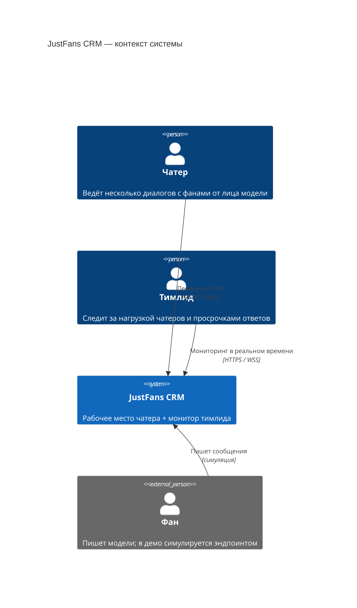
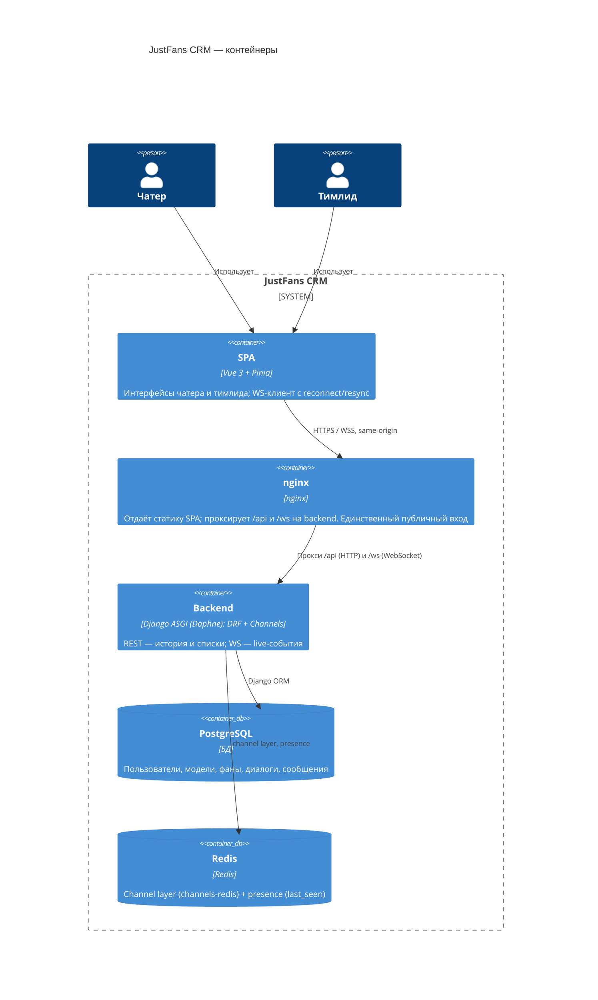
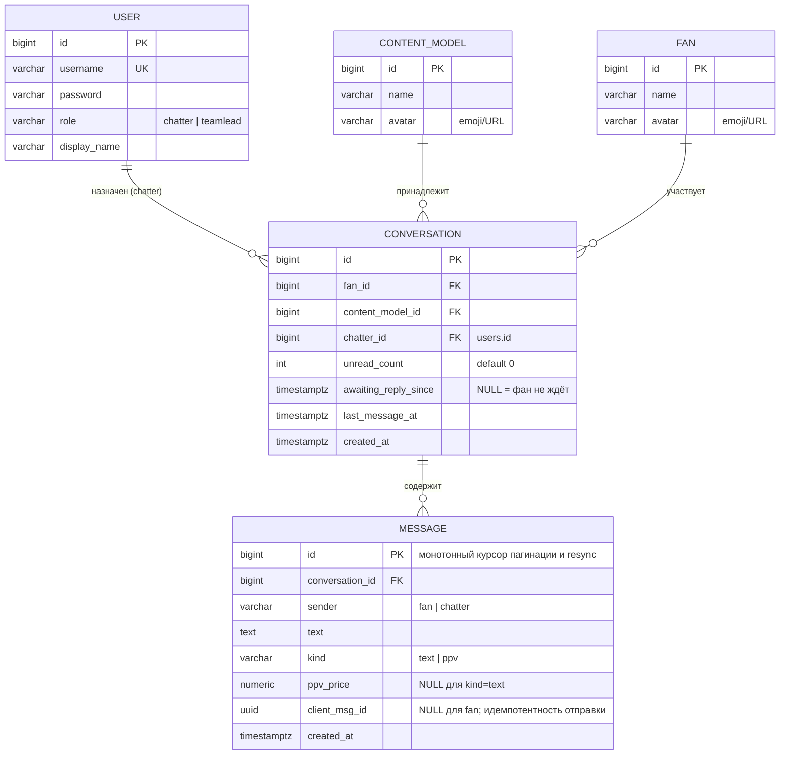
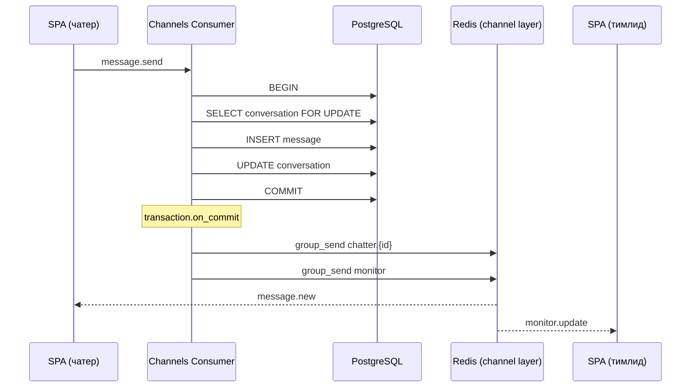
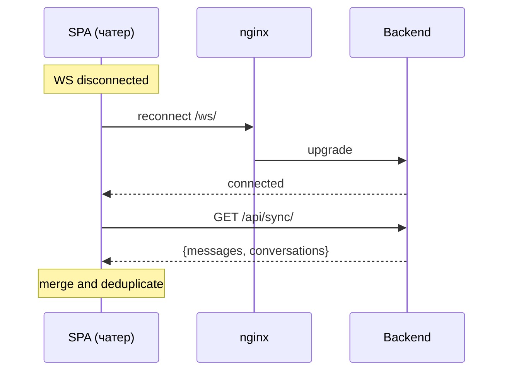

# Design: add-chatter-crm

## Context

Greenfield-реализация мини-CRM для чатеров по ТЗ. Два репозитория (`justfans-backend`, `justfans-frontend`), стек зафиксирован ТЗ: Django + DRF + Channels, Vue 3 + Pinia, PostgreSQL, Redis. Решение запускается одной командой (`docker compose up`) и деплоится на Railway. Спецификацию реализует AI-агент — все контракты в этом документе нормативны.

## Goals / Non-Goals

**Goals:**

- Рабочее место чатера: список диалогов, переписка, PPV, realtime, пагинация истории.
- Монитор тимлида: presence, нагрузка, просрочки — в реальном времени.
- Метрика времени ответа с настраиваемым порогом X.
- Устойчивый WebSocket: переподключение + resync без дублей и потерь.
- Проверяемость в одиночку: сидер, эмуляция фана, тестовые учётки.

**Non-Goals:**

- Реальный клиент фана, авторизация фанов (фан — симулируемый актор).
- Платёжный флоу PPV (покупка, разблокировка) — только отправка с ценой.
- Медиа-вложения, назначение/переназначение диалогов (фиксируется сидером), несколько чатеров на диалог.
- Горизонтальное масштабирование бэкенда (но channel layer уже Redis — масштабирование не заблокировано).

## Архитектура (C4)

### Уровень 1: Контекст



### Уровень 2: Контейнеры



Один публичный origin (nginx) и локально, и на Railway: сессионная авторизация работает без CORS/CSRF-экзотики, WS проксируется тем же хостом.

## Схема БД



Ограничения и индексы:

- `UNIQUE (fan_id, content_model_id)` на `CONVERSATION` — один диалог пары фан-модель.
- `UNIQUE (conversation_id, client_msg_id)` на `MESSAGE` (частичный, где `client_msg_id IS NOT NULL`) — защита от дублей при повторной отправке.
- `INDEX (conversation_id, id)` на `MESSAGE` — пагинация и resync.
- `CHECK`: `kind = 'ppv'` ⇒ `ppv_price IS NOT NULL AND ppv_price > 0`.
- `USER` — кастомная модель `accounts.User` (`AUTH_USER_MODEL`) с полем `role`.

Денормализация на `CONVERSATION` (`unread_count`, `awaiting_reply_since`, `last_message_at`) — сознательная: список диалогов и монитор тимлида читаются без агрегаций по `MESSAGE`. Обновления — только под `select_for_update` (см. Decisions).

## API-контракты

### REST

Все ответы — JSON. Авторизация — Django session (cookie). Ошибки — стандарт DRF (`{"detail": ...}`, коды 400/401/403/404).

| Метод | Путь | Кто | Назначение |
|---|---|---|---|
| POST | `/api/auth/login/` | все | Вход: `{username, password}` → `{id, username, display_name, role}` |
| POST | `/api/auth/logout/` | authed | Выход |
| GET | `/api/auth/me/` | authed | Текущий пользователь (тот же payload, что login) |
| GET | `/api/config/` | authed | `{overdue_seconds, presence_grace_seconds, heartbeat_seconds}` |
| GET | `/api/conversations/` | chatter | Список диалогов чатера (см. payload ниже) |
| GET | `/api/conversations/{id}/messages/?before_id=&limit=` | chatter (свой диалог) | Страница истории: сообщения с `id < before_id` (без параметра — самые новые), сортировка `id DESC`, `limit` ≤ 100, default 30. Ответ: `{results: [Message], has_more: bool}` |
| POST | `/api/conversations/{id}/read/` | chatter (свой диалог) | Обнулить непрочитанные → `{conversation_id, unread_count: 0}` |
| GET | `/api/sync/?after_id=` | chatter | Resync после reconnect: `{messages: [Message с id > after_id по всем диалогам чатера, ASC, cap 500], conversations: [Conversation]}` |
| GET | `/api/monitor/snapshot/` | teamlead | Снапшот дашборда (см. payload ниже) |
| POST | `/api/demo/fan-message/` | authed | Эмуляция фана: `{conversation_id?, text?}` (без аргументов — случайный диалог, случайная фраза) → созданный `Message` |

Payload `Conversation` (список диалогов и sync):

```json
{
  "id": 12,
  "fan": {"id": 3, "name": "Mike", "avatar": "🧔"},
  "model": {"id": 1, "name": "Stella", "avatar": "💃"},
  "last_message": {"text": "see you 😘", "sender": "chatter", "created_at": "..."},
  "last_message_at": "2026-06-12T10:15:00Z",
  "unread_count": 2,
  "awaiting_reply_since": "2026-06-12T10:14:00Z"
}
```

Payload `Message`:

```json
{
  "id": 1042,
  "conversation_id": 12,
  "sender": "fan",
  "kind": "text",
  "text": "hey, you there?",
  "ppv_price": null,
  "client_msg_id": null,
  "created_at": "2026-06-12T10:14:00Z"
}
```

Payload `/api/monitor/snapshot/`:

```json
{
  "chatters": [
    {
      "id": 5,
      "display_name": "Alice",
      "connected": true,
      "last_seen": "2026-06-12T10:15:30Z",
      "dialogs_count": 4,
      "waiting": [{"conversation_id": 12, "fan_name": "Mike", "waiting_since": "2026-06-12T10:14:00Z"}]
    }
  ]
}
```

Просрочка и offline **не** присылаются как флаги: фронтенд вычисляет их из `waiting_since` / `last_seen` и порогов из `/api/config/`, тикая локальным таймером (см. Decisions #4).

### WebSocket

Один endpoint `/ws/` для обеих ролей; авторизация — та же сессия (`AuthMiddlewareStack`). Конверт сообщений: `{"type": "<событие>", "payload": {...}}`.

Группы Channels:

| Группа | Кто подписан | Что летит |
|---|---|---|
| `chatter.{user_id}` | все соединения этого чатера (вкладки) | `message.new`, `conversation.read` |
| `monitor` | все тимлиды | `monitor.update` |

Группа на диалог не нужна: у диалога ровно один назначенный чатер, события диалога — подмножество событий чатера.

Клиент → сервер:

| type | payload | Семантика |
|---|---|---|
| `message.send` | `{conversation_id, text, kind: "text"\|"ppv", ppv_price?, client_msg_id: uuid}` | Отправка сообщения чатером. Повтор с тем же `client_msg_id` не создаёт дубль (возвращает существующее) |
| `ping` | `{}` | Heartbeat каждые `heartbeat_seconds`; обновляет presence. Ответ: `pong` |

Сервер → клиент (чатеру, группа `chatter.{id}`):

| type | payload | Когда |
|---|---|---|
| `message.new` | `{message: Message, conversation: Conversation}` | Любое новое сообщение в любом диалоге чатера — и от фана, и собственное (подтверждение: клиент матчит по `client_msg_id`) |
| `conversation.read` | `{conversation_id}` | Диалог отмечен прочитанным (синхронизация вкладок) |
| `error` | `{code, detail}` | Невалидный `message.send` (чужой диалог, пустой текст, PPV без цены) |

Сервер → клиент (тимлиду, группа `monitor`):

| type | payload | Когда |
|---|---|---|
| `monitor.update` | элемент `chatters[]` из снапшота | Переходы состояния: connect/disconnect чатера, новое сообщение фана, ответ чатера |

## Ключевые сценарии

### Отправка сообщения чатером



То же для входящего сообщения фана (`POST /api/demo/fan-message/`): в той же транзакции `unread_count += 1`, `awaiting_reply_since = now()` (если был `NULL`), затем `on_commit` — рассылка тех же двух событий.

### Reconnect и resync



Подписка на группу происходит **до** запроса sync — сообщение, созданное между подпиской и ответом sync, придёт обоими путями и схлопнется дедупом. Потерь нет: всё, что старше — в ответе sync; всё, что новее — в группе.

## Decisions

1. **Один публичный origin через nginx; сессионная авторизация.**
   nginx отдаёт SPA и проксирует `/api`, `/ws` → same-origin, стандартные Django-сессии и CSRF, ноль CORS-конфигурации, одна и та же топология локально и на Railway.
   *Альтернатива:* JWT + раздельные домены (SPA на Vercel) — отвергнута: больше движущихся частей (хранение токена, передача в WS), выгоды для задачи нет.

2. **Отправка сообщений — через WS с `client_msg_id` (UUID, генерирует клиент).**
   ТЗ требует «сообщения уходят через WebSocket». UUID + уникальный индекс дают идемпотентность: обрыв после отправки и повторная отправка не создают дубль.
   *Альтернатива:* отправка через REST POST — противоречит ТЗ.

3. **Группы Channels: `chatter.{user_id}` и `monitor`.**
   Диалог принадлежит ровно одному чатеру, поэтому группа на диалог дублировала бы группу чатера. Группа на чатера автоматически синхронизирует несколько вкладок.
   *Альтернатива:* группа на диалог — осмысленна при нескольких участниках диалога, чего нет (non-goal).

4. **Время-зависимые состояния (просрочка > X, offline после grace) вычисляет фронтенд из серверных timestamps.**
   Сервер шлёт события только при переходах (сообщение, connect/disconnect) и отдаёт `waiting_since` / `last_seen`; клиент тикает локальным таймером и подсвечивает. Не нужны Celery beat / фоновые тикеры / периодический пуш «проверь просрочки».
   *Альтернатива:* серверный scheduler, рассылающий `overdue`-события — лишний контейнер и источник гонок ради состояния, которое детерминированно выводится из timestamp + конфига.

5. **Монотонный `BIGINT id` сообщения — единый курсор пагинации (`before_id`) и resync (`after_id`).**
   Один механизм вместо двух; `created_at` неуникален и подвержен сдвигам часов.
   *Альтернатива:* keyset по `created_at` или snowflake — сложнее без выгоды на одном инстансе БД.

6. **Resync одним запросом `GET /api/sync/?after_id=` по всем диалогам чатера.**
   Один round-trip после reconnect вместо N запросов по диалогам; заодно возвращает свежие снапшоты диалогов (счётчики, таймеры).

7. **Изменение состояния + рассылка: `transaction.atomic()` + `select_for_update` на диалоге + `transaction.on_commit` для `group_send`.**
   Событие никогда не уходит для отката; счётчики не теряют инкременты при гонках.

8. **Presence: heartbeat `ping` каждые `heartbeat_seconds`, `last_seen` в Redis (`SETEX`), события connect/disconnect в `monitor`.**
   Жёсткие обрывы сети, на которых `disconnect()` не вызывается, закрывает протухание `last_seen` + grace на клиенте (Decision 4).

9. **Кастомная модель пользователя `accounts.User` с `role`.**
   Стандартная практика greenfield-Django; роль — одно поле вместо групп/пермишенов, которых хватило бы для двух ролей, но читалось бы хуже.

Конфигурация через env (с дефолтами для демо): `OVERDUE_SECONDS` (X, default 120), `PRESENCE_GRACE_SECONDS` (default 30), `HEARTBEAT_SECONDS` (default 10), `MESSAGES_PAGE_SIZE` (default 30).

## Risks / Trade-offs

- **[Гонка автоинкремента при resync]** Транзакция с `id=100` может закоммититься позже, чем `id=101`; `sync?after_id=101` её не увидит. → На деле окно — миллисекунды одной вставки; событие `message.new` уходит `on_commit` и доедет по WS, клиент дедупит по id. Для demo-нагрузки принято осознанно.
- **[Денормализованный `unread_count`]** Может разойтись с фактом при ручных правках БД. → Все изменения только под `select_for_update`; сидер выставляет консистентные значения.
- **[Railway free tier]** Засыпание/лимиты бесплатного плана. → Та же compose-топология, что локально; в README — что делать при холодном старте; сидер прогоняется при деплое.
- **[Один инстанс backend]** Presence и группы корректны и при нескольких инстансах (Redis), но дизайн не тестировался на масштаб. → Non-goal, зафиксировано.

## Migration Plan

Не применимо (greenfield). Порядок деплоя: Railway-проект → сервисы PostgreSQL и Redis → backend (миграции + сидер в release-команде) → frontend (nginx, публичный домен). Rollback — redeploy предыдущего образа.

## Open Questions

Нет блокирующих. Точные значения порогов по умолчанию можно менять через env без правок кода.
